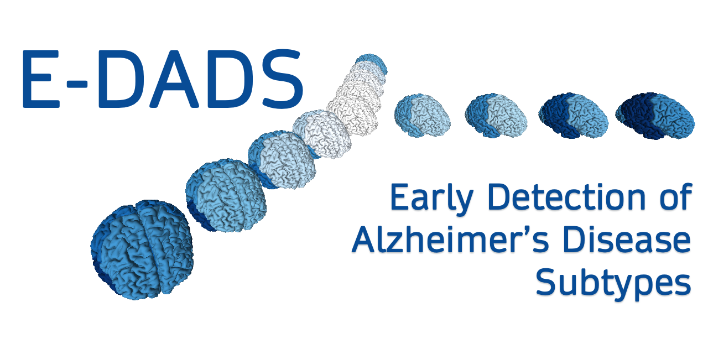

E-DADS is an international research team bridging `Computer Science` and Neurology, led by University College London.

# E-DADS partners

* **UCL**, UK: University College London
  - Danny Alexander, Andre Altmann, Neil Oxtoby
* **VUmc**, NL: Stichting VU University Medical Center
  - Wiesje M van der Flier, Frederik Barkhof
* **FBF**, IT: IRCCS Fatebenefratelli Brescia
  - Alberto Redolfi, Libera Cavaliere
* **ICM**, FR: INRIA, Institut du Cerveau et de la Moelle épinière --- Brain and Spine Institute
  - Stanley Durrleman
* **CSIRO**, AU: Commonwealth Scientific and Industrial Research Organisation
  - Samantha Burnham, Victor Villemagne

* * *

### Related projects

*   [EuroPOND](http://europond.eu)
*   [UCL POND](http://pond.cs.ucl.ac.uk)
*   [E-PAD](http://ep-ad.org)

